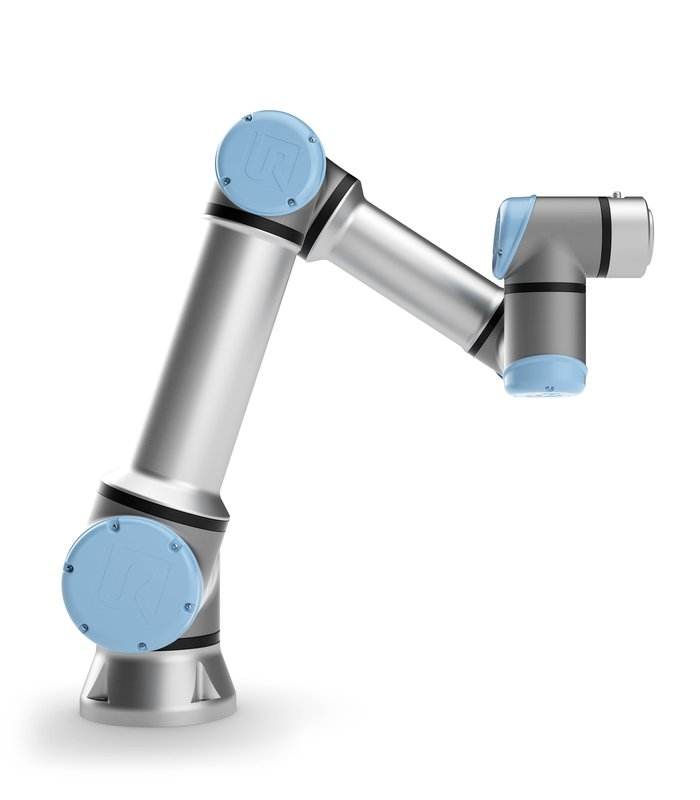

# UR_kinematics
## Solution of forward and inverse kinematics problems for Universal Robots


## Example of execution: 
### Forward kinematics
```
Code:
 ed = np.matrix([[1.572584629058838], [-1.566467599277832], [-0.0026149749755859375], [-1.568673924808838],
                    [-0.009446446095601857], [0.007950782775878906]])
 transform = forward_kinematic_solution(DH_matrix_UR5e, ed)
 print(transform)
 
Out:
[[-7.65789463e-03  5.40271395e-05  9.99970676e-01  2.32902042e-01]
 [-9.99901213e-01  1.17864251e-02 -7.65799947e-03 -3.41865209e-03]
 [-1.17864932e-02 -9.99930536e-01 -3.62373991e-05  1.07939110e+00]
 [ 0.00000000e+00  0.00000000e+00  0.00000000e+00  1.00000000e+00]]
```
### Inverse kinematics
```
Code:
 transform = np.matrix([[-7.65789463e-03  5.40271395e-05  9.99970676e-01  2.32902042e-01]
                        [-9.99901213e-01  1.17864251e-02 -7.65799947e-03 -3.41865209e-03]
                        [-1.17864932e-02 -9.99930536e-01 -3.62373991e-05  1.07939110e+00]
                        [ 0.00000000e+00  0.00000000e+00  0.00000000e+00  1.00000000e+00]])
 IKS = inverse_kinematic_solution(DH_matrix_UR5e, transform)
 print(IKS)              # all solutions
 print(IKS[:, 1])        # first solution
 
Out:
[[ 1.57258463e+00  1.57258463e+00  1.57258463e+00  1.57258463e+00   1.52916609e+00  1.52916609e+00  1.52916609e+00  1.52916609e+00]
 [-1.56757306e+00 -1.56757306e+00 -1.57005021e+00 -1.57005021e+00  -1.57524796e+00 -1.57316784e+00 -1.56313367e+00 -1.56313367e+00]
 [ 0.00000000e+00  0.00000000e+00  0.00000000e+00  0.00000000e+00   2.16710481e-03 -2.16710481e-03  0.00000000e+00  0.00000000e+00]
 [ 1.57140922e+00  1.57140922e+00  1.57388636e+00  1.57388636e+00  -1.56957868e+00 -1.56732459e+00 -1.57952587e+00 -1.57952587e+00]
 [ 9.44644610e-03  9.44644610e-03 -9.44644610e-03 -9.44644610e-03   3.39721849e-02  3.39721849e-02 -3.39721849e-02 -3.39721849e-02]
 [-3.13364187e+00 -3.13364187e+00 -3.13364187e+00 -3.13364187e+00   1.28530345e-02  1.28530345e-02  1.28530345e-02  1.28530345e-02]]

[[ 1.57258463]
 [-1.56757306]
 [ 0.        ]
 [ 1.57140922]
 [ 0.00944645]
 [-3.13364187]]
```
